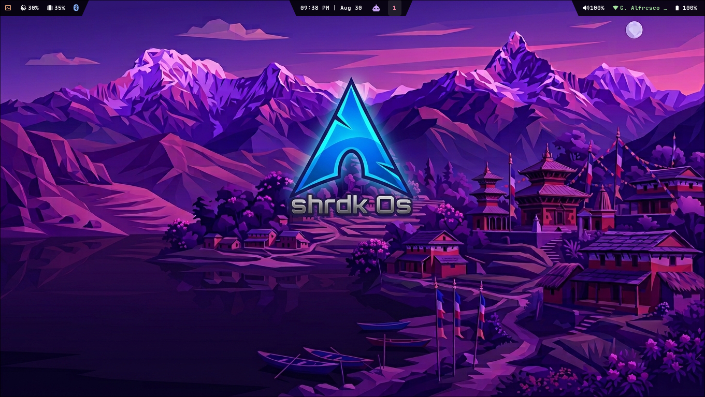
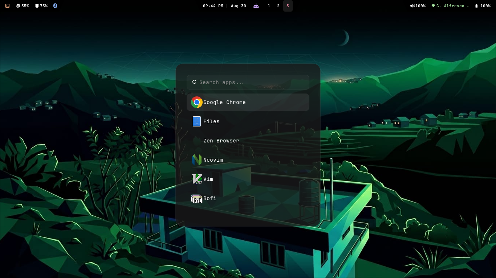
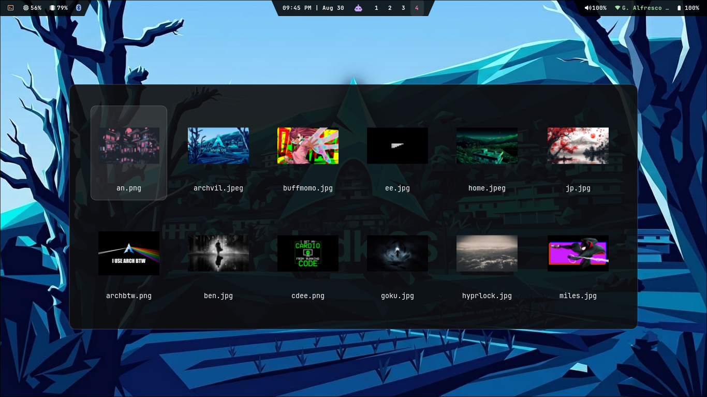
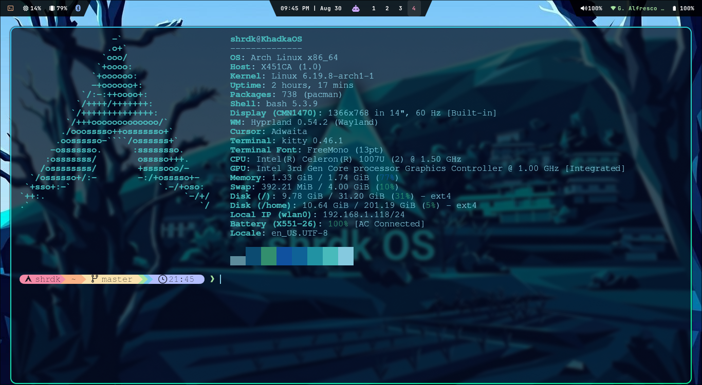
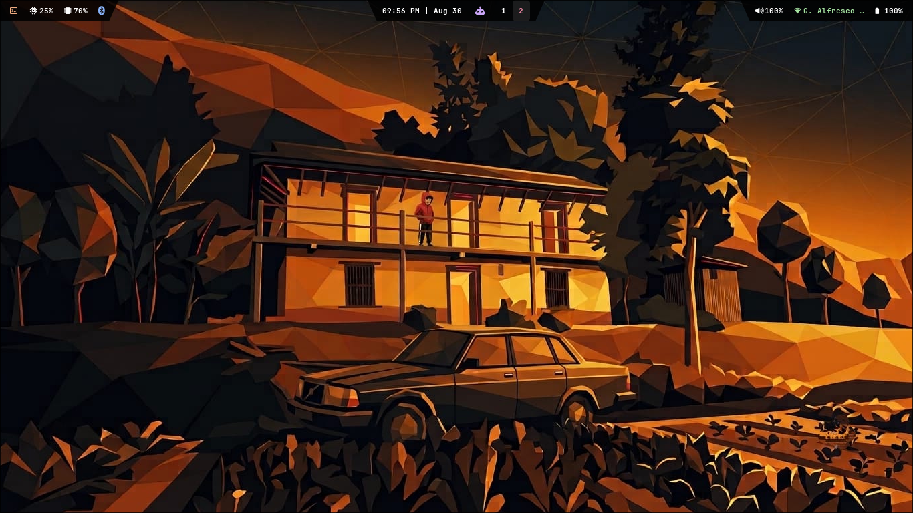

# ShrdkOS

# main screen

  

# Rofi App launcher

  

# Rofi based wallpaper selector

  

# kitty Terminal

  

# BEST WALLPAPER?

  

## About
My Os is currently under active development.

More updates will be shared soon, including:

- configuration files
- ISO images
- build details
- feature progress

## Status

**Work in progress: stay tuned for upcoming releases.**

